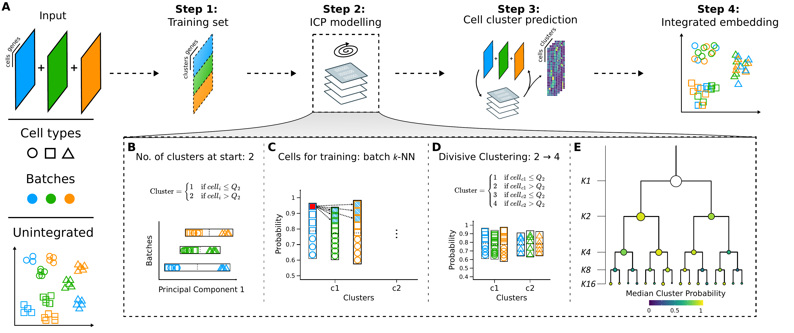

# Coralysis

---

<br>

#### Coralysis is an R package featuring a multi-level integration algorithm for sensitive integration, reference-mapping, and cell state identification in single-cell data.

<br>

<br>



*Coralysis integration flowchart. (A) An input of heterogeneous scRNA-seq datasets are overclustered batch wise into a training set modelled through the Iterative Clustering Projection (ICP) algorithm in order to predict the cell cluster probabilities and obtain an integrated embedding. Adaptations to the original ICP algorithm (Smolander et al., 2021): (B) batch wise cluster assignment at start, dependent on the cell distribution across Principal Component 1 (median as cutoff); (C) training cells selected from batch k nearest neighbours of the cell with the highest probability for every batch per cluster; and, (D) upon ICP clustering convergence, each cluster is further divided into two for the next clustering round, dependent on the batch wise cluster probability distribution (median as cutoff). (E) Multi-level integration is achieved through multiple divisive clustering rounds, blending the batch effect and highlighting the biological signal incrementally. Shapes represent cell types and colours batches.*

<br>

---

<br>

## Installation

<br>

The latest version of `Coralysis` can be downloaded from GitHub using the devtools R package.

```R
devtools::install_github("elolab/Coralysis")
```

<br>

---

<br>

## Quick-start

<br>

To run `Coralysis`, follow the instructions below: 

```R
# Packages
library("SingleCellExperiment")
library("Coralysis")

# Prepare data: checks 'logcounts' format & removes non-expressed genes
pbmc_10Xassays <- PrepareData(object = pbmc_10Xassays)

# Multi-level integration
set.seed(123)
pbmc_10Xassays <- RunParallelDivisiveICP(object = pbmc_10Xassays, batch.label = "batch", threads = 4) 

# Compute integrated PCA from joint probability
set.seed(125)
pbmc_10Xassays <- RunPCA(object = pbmc_10Xassays)

# Run UMAP
set.seed(1204)
pbmc_10Xassays <- RunUMAP(object = pbmc_10Xassays, umap.method = "uwot", n_neighbors = 20, min_dist = 0.3)

# Visualize integrated data 
vars <- c("batch", "cell_type")
plots <- lapply(X = vars, FUN = function(x) {
    PlotDimRed(object = pbmc_10Xassays, color.by = x, point.size = 0.5, point.stroke = 0.5, legend.nrow = 3)
}) 
cowplot::plot_grid(plotlist = plots, ncol = 2, align = "vh") # join plots together
```

<br>

---

<br>

## Contact information

<br>

If you have questions related to `Coralysis`, please contact us [here](https://github.com/elolab/Coralysis/issues). 

<br>

---

<br>

## References

<br>

1. Johannes Smolander, Sini Junttila, Mikko S Venäläinen, Laura L Elo. "ILoReg: a tool for high-resolution cell population identification from single-cell RNA-seq data". Bioinformatics, Volume 37, Issue 8, 15 April 2021, Pages 1107–1114, [https://doi.org/10.1093/bioinformatics/btaa919](https://doi.org/10.1093/bioinformatics/btaa919).

<br>

<br>

<br>
