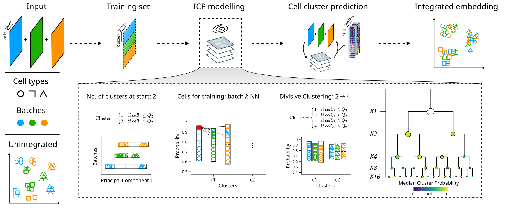

# ILoReg2

<br>

ILoReg2 is an R package for sensitive identification of shared cell types/states across heterogeneous single-cell RNA-sequencing (scRNA-seq) datasets through “puzzle” integration. The method involves multiple divisive clustering rounds to blend in the batch effect and to highlight the biological signal, utilizing our Iterative Clustering Projection (ICP) [[1]](https://doi.org/10.1093/bioinformatics/btaa919) algorithm to progressively focus on low- to high-level features. In addition, the tool enables training a reference model for projecting and annotating new datasets through reference-mapping.

<br>



<br>

---

<br>

## Installation

<br>

The latest version of `ILoReg2` can be downloaded from GitHub using the devtools R package.

```R

devtools::install_github("elolab/ILoReg2")

```

<br>

---

<br>

## Contact information

<br>

If you have questions related to `ILoReg2`, please contact us [here](https://github.com/elolab/ILoReg2/issues). 

<br>

---

<br>

## References

<br>

1. Johannes Smolander, Sini Junttila, Mikko S Venäläinen, Laura L Elo. " ILoReg: a tool for high-resolution cell population identification from single-cell RNA-seq data". Bioinformatics, Volume 37, Issue 8, 15 April 2021, Pages 1107–1114, [https://doi.org/10.1093/bioinformatics/btaa919](https://doi.org/10.1093/bioinformatics/btaa919).