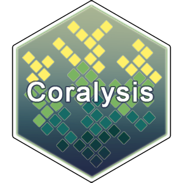
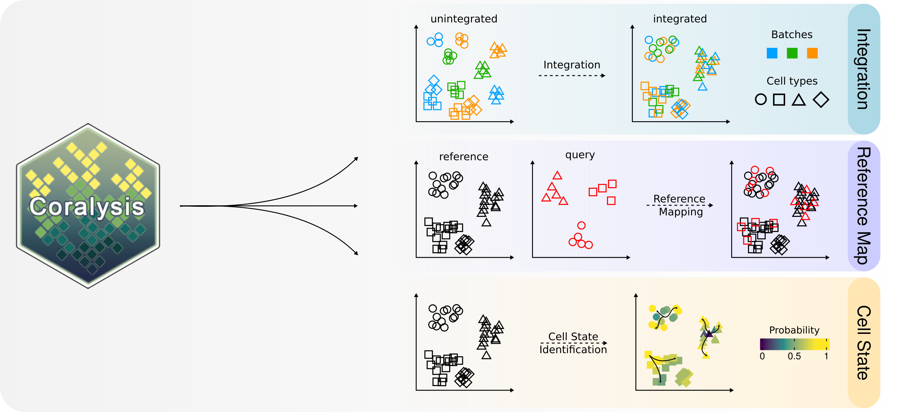
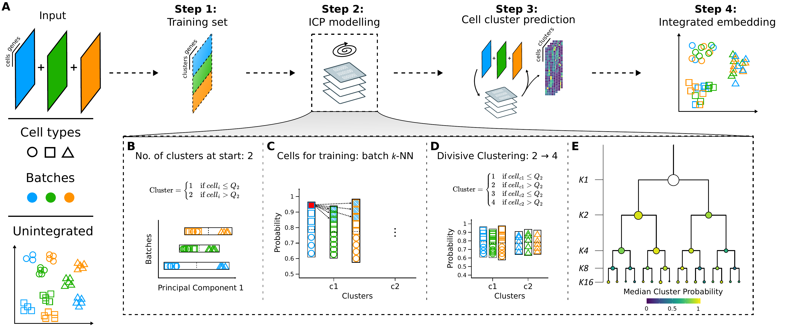

<!-- README.md is generated from README.Rmd. Please edit that file -->

# Coralysis <a href="https://elolab.github.io/Coralysis"></a>

<!-- badges -->

[](https://www.bioconductor.org/packages/Coralysis)
[](https://github.com/elolab/Coralysis)
[](https://bioconductor.org/packages/stats/bioc/Coralysis)
[](https://doi.org/10.1101/2025.02.07.637023)

## :book: Overview

Coralysis is an R package featuring a multi-level integration algorithm
for sensitive integration, reference-mapping, and cell state
identification in single-cell data, described in the paper *[“Coralysis
enables sensitive identification of imbalanced cell types and states in
single-cell data via multi-level
integration”](https://doi.org/10.1101/2025.02.07.637023)*.

<p align="center">

<p style="text-align:center;">


</p>

</p>

Coralysis relies on an adapted version of our previously introduced
Iterative Clustering Projection (ICP) algorithm ([Smolander et al.,
2021](https://doi.org/10.1093/bioinformatics/btaa919)) to identify
shared cell clusters across heterogeneous datasets by leveraging
multiple rounds of divisive clustering.

Inspired by the process of assembling a puzzle - where one begins by
grouping pieces based on low-to high-level features, such as color and
shading, before looking into shape and patterns - this multi-level
integration algorithm progressively blends the batch effects while
separating cell types across multiple runs of divisive clustering. The
trained ICP models can then be used for various purposes, including
prediction of cluster identities of related, unannotated single-cell
datasets through reference-mapping, and inference of cell states and
their differential expression programs using the cell cluster
probabilities that represent the likelihood of each cell belonging to
each cluster.

While state-of-the-art single-cell integration methods often struggle
with imbalanced cell types across heterogeneous datasets, Coralysis
effectively differentiates similar yet unshared cell types across
batches.

<p align="center">

<p style="text-align:center;">


</p>

</p>

> **Coralysis integration flowchart**.</b> (<b>A</b>) An input of
> heterogeneous single-cell datasets are overclustered batch wise into a
> training set modelled through the Iterative Clustering Projection
> (ICP) algorithm in order to predict the cell cluster probabilities and
> obtain an integrated embedding. Adaptations to the original ICP
> algorithm (Smolander et al., 2021): (<b>B</b>) batch wise cluster
> assignment at start, dependent on the cell distribution across
> Principal Component 1 (median as cutoff); (<b>C</b>) training cells
> selected from batch k nearest neighbours of the cell with the highest
> probability for every batch per cluster; and, (<b>D</b>) upon ICP
> clustering convergence, each cluster is further divided into two for
> the next clustering round, dependent on the batch wise cluster
> probability distribution (median as cutoff). (<b>E</b>) Multi-level
> integration is achieved through multiple divisive clustering rounds,
> blending the batch effect and highlighting the biological signal
> incrementally. Shapes represent cell types and colours batches.

<br>

<br>

## :package: Installation

`Coralysis` can be installed from the development version of
[Bioconductor](https://bioconductor.org/packages/devel/bioc/html/Coralysis.html).

``` r
if (!require("BiocManager", quietly = TRUE))
    install.packages("BiocManager")

# The following initializes usage of Bioc devel
BiocManager::install(version="devel")

BiocManager::install("Coralysis")
```

Alternatively, the latest version of `Coralysis` can be installed from
GitHub using the [`devtools`](https://devtools.r-lib.org/) R package.

``` r
devtools::install_github("elolab/Coralysis")
```

<br>

<br>

## :hammer_and_wrench: Usage

`Coralysis` requires as input a
[`SingleCellExperiment`](https://bioconductor.org/books/3.13/OSCA.intro/the-singlecellexperiment-class.html)
object containing the log-normalized single-cell (gene or protein)
expression matrix (available in the `logcounts` assay) and the
corresponding batch label identities (stored in the `colData` of the
`SingleCellExperiment` object).

The output consists of a set of ICP (Iterative Clustering Projection)
models along with the associated cell cluster probability matrices.
These results are used to compute a Principal Component Analysis
(PCA)-based integrated embedding that represents the integration
outcome.

The following code snippet highlights the basic function calls to
perform integration with `Coralysis`. See the *Vignettes* section below
for fully reproducible examples.

``` r
# Import packages
library("Coralysis")
suppressPackageStartupMessages(library("SingleCellExperiment"))

# Perform multi-level integration
set.seed(123)
sce <- RunParallelDivisiveICP(
  object = sce, # 'SingleCellExperiment' object w/ 'logcounts' & 'colData(sce)'
  batch.label = "batch", # column in 'colData(sce)' w/ batch label identity
  threads = 2 # no. of threads to parallelize ICP runs
)

# Obtain the integrated embedding
set.seed(39)
sce <- RunPCA(object = sce) # stored in 'reducedDims(sce)' (by default named 'PCA')
```

As an alternative to the Bioconductor ecosystem, the `Coralysis`
integration algorithm can be called directly on
[`Seurat`](https://satijalab.org/seurat) objects after installing the
[`SeuratWrappers`](https://github.com/satijalab/seurat-wrappers) R
package.

This feature is not yet available in the official repository
([`satijalab/seurat-wrappers`](https://github.com/satijalab/seurat-wrappers))
as our pull request is still under review (see [pull
request](https://github.com/satijalab/seurat-wrappers/pull/215)).

In the meantime, users can install the `SeuratWrappers` package from our
repository—[`elolab/seurat-wrappers`](https://github.com/elolab/seurat-wrappers/tree/CoralysisIntegration)
(`CoralysisIntegration` branch).

Below is a minimal reproducible example adapted from the Seurat vignette
[*Introduction to scRNA-seq
integration*](https://satijalab.org/seurat/articles/integration_introduction),
demonstrating the use of the `Coralysis` method
(`CoralysisIntegration`).

See the *Vignettes* section below for additional use cases.

``` r
# Install 'SeuratWrappers'
devtools::install_github("elolab/seurat-wrappers@CoralysisIntegration")

# Import packages 
library("Seurat")
library("SeuratData")
library("SeuratWrappers")

# Import single-cell data
InstallData("ifnb")
ifnb <- LoadData("ifnb")
ifnb <- UpdateSeuratObject(ifnb)

# Run basic Seurat workflow
ifnb[["RNA"]] <- split(ifnb[["RNA"]], f = ifnb$stim)
ifnb <- NormalizeData(ifnb)
ifnb <- FindVariableFeatures(ifnb)
ifnb <- ScaleData(ifnb)
ifnb <- RunPCA(ifnb)

# Perform Coralysis integration: 'method = CoralysisIntegration'
set.seed(45)
ifnb <- IntegrateLayers(
  object = ifnb, 
  method = CoralysisIntegration, 
  new.reduction = "integrated.coralysis",
  batch = "stim", 
  threads = 4 # this function accepts any ?Coralysis::RunParallelDivisiveICP specific parameter 
)

# Perform UMAP & clustering on the Coralysis integrated embedding w/ Seurat
ifnb <- RunUMAP(ifnb, reduction = "integrated.coralysis", dims = 1:30)
ifnb <- FindNeighbors(ifnb, reduction = "integrated.coralysis", dims = 1:30)
ifnb <- FindClusters(ifnb)
```

In the absence of the `SeuratWrappers` package, users can still
interoperate between `Coralysis` and `Seurat` by using the `Seurat`
functions `as.SingleCellExperiment()` and `as.Seurat()`, which enable
conversion between the native Seurat object format (`SeuratObject`) and
the `SingleCellExperiment` format used by `Coralysis`, with a few minor
adjustments.

The example above is reproduced below without using the `SeuratWrappers`
package.

Only the section for converting between object formats and running
`Coralysis` is highlighted here. Click on *Details* after the code
snippet to view the full minimal reproducible example.

``` r
## Import packages 
# It requires 'Coralysis' to be installed
#but it is not required to load it
library("Seurat")

# Convert SeuratObject to SingleCellExperiment
ifnb[["RNA"]] <- JoinLayers(ifnb[["RNA"]])
ifnb.sce <- as.SingleCellExperiment(ifnb)

## Use the same HVG used in Seurat
# Create an alternative experiment (equivalent to 'assays' in Seurat)
seurat.hvg <- VariableFeatures(ifnb)
SingleCellExperiment::altExp(x = ifnb.sce, e = "int") <- ifnb.sce[seurat.hvg,] # creating 'int' assay
ifnb.sce <- SingleCellExperiment::swapAltExp(x = ifnb.sce, # switch to 'int' assay
                                             name = "int", 
                                             withColData = FALSE) 

## Coralysis specific functions
set.seed(129)
ifnb.sce <- Coralysis::RunParallelDivisiveICP(
  object = ifnb.sce, # it took ~5 min.
  batch.label = "stim", 
  threads = 4)
set.seed(75)
ifnb.sce <- Coralysis::RunPCA(object = ifnb.sce, 
                              dimred.name = "integrated.coralysis") # integrated output

# Convert SingleCellExperiment to Seurat & copy integrated embedding to SeuratObject
ifnb.sce <- SingleCellExperiment::swapAltExp(x = ifnb.sce, 
                                             name = "RNA", 
                                             withColData = FALSE) 
SingleCellExperiment::reducedDims(ifnb.sce) <- SingleCellExperiment::reducedDims(SingleCellExperiment::altExp(ifnb.sce))
SingleCellExperiment::altExp(ifnb.sce) <- NULL
ifnb <- as.Seurat(ifnb.sce) 
```

<details>

``` r
## Import packages 
# It requires 'Coralysis' to be installed
#but it is not required to load it
library("Seurat")
library("SeuratData")
library("SeuratWrappers")

## Import single-cell data
InstallData("ifnb")
ifnb <- LoadData("ifnb")
ifnb <- UpdateSeuratObject(ifnb)

## Run basic Seurat workflow
ifnb[["RNA"]] <- split(ifnb[["RNA"]], f = ifnb$stim)
ifnb <- NormalizeData(ifnb)
ifnb <- FindVariableFeatures(ifnb)
ifnb <- ScaleData(ifnb)
ifnb <- RunPCA(ifnb)

#-----------------------------------------------------------------------------------------------#
#
## Convert between SeuratObject-SingleCellExperiment-SeuratObject; 
## perform Coralysis integration & embedding 

# Convert SeuratObject to SingleCellExperiment
ifnb[["RNA"]] <- JoinLayers(ifnb[["RNA"]])
ifnb.sce <- as.SingleCellExperiment(ifnb)

## Use the same HVG used in Seurat
# Create an alternative experiment (equivalent to 'assays' in Seurat)
seurat.hvg <- VariableFeatures(ifnb)
SingleCellExperiment::altExp(x = ifnb.sce, e = "int") <- ifnb.sce[seurat.hvg,] # creating 'int' assay
ifnb.sce <- SingleCellExperiment::swapAltExp(x = ifnb.sce, # switch to 'int' assay
                                             name = "int", 
                                             withColData = FALSE) 

## Coralysis specific functions
set.seed(129)
ifnb.sce <- Coralysis::RunParallelDivisiveICP(
  object = ifnb.sce, # it took ~5 min.
  batch.label = "stim", 
  threads = 4)
set.seed(75)
ifnb.sce <- Coralysis::RunPCA(object = ifnb.sce, 
                              dimred.name = "integrated.coralysis") # integrated output

# Convert SingleCellExperiment to Seurat & copy integrated embedding to SeuratObject
ifnb.sce <- SingleCellExperiment::swapAltExp(x = ifnb.sce, 
                                             name = "RNA", 
                                             withColData = FALSE) 
SingleCellExperiment::reducedDims(ifnb.sce) <- SingleCellExperiment::reducedDims(SingleCellExperiment::altExp(ifnb.sce))
SingleCellExperiment::altExp(ifnb.sce) <- NULL
ifnb <- as.Seurat(ifnb.sce) 
#
#-----------------------------------------------------------------------------------------------#

# Continue w/ Seurat workflow: UMAP & graph-based clustering on the integrated embedding
ifnb <- FindNeighbors(ifnb, reduction = "integrated.coralysis", dims = 1:30)
ifnb <- FindClusters(ifnb, resolution = 1)
ifnb <- RunUMAP(ifnb, dims = 1:30, reduction = "integrated.coralysis", 
                reduction.name = "umap.Coralysis")
```

</details>

<br>

<br>

## :bookmark_tabs: Vignettes

- Bioconductor vignettes:

  - [Get
    started](https://bioconductor.org/packages/devel/bioc/vignettes/Coralysis/inst/doc/Coralysis.html)

  - [Integration](https://bioconductor.org/packages/devel/bioc/vignettes/Coralysis/inst/doc/Integration.html)

  - [Reference-mapping](https://bioconductor.org/packages/devel/bioc/vignettes/Coralysis/inst/doc/RefMap.html)

  - [Cell
    States](https://bioconductor.org/packages/devel/bioc/vignettes/Coralysis/inst/doc/CellState.html)

- `Coralysis` website vignettes:

  - [Get
    started](https://elolab.github.io/Coralysis/articles/Coralysis.html)

  - [Integration](https://elolab.github.io/Coralysis/articles/Integration.html)

  - [Reference-mapping](https://elolab.github.io/Coralysis/articles/RefMap.html)

  - [Cell
    States](https://elolab.github.io/Coralysis/articles/CellState.html)

- `Coralysis`/[`Seurat`](https://satijalab.org/seurat) vignette:

  - [Running `Coralysis` integration on `Seurat`
    Objects](https://htmlpreview.github.io/?https://github.com/elolab/seurat-wrappers/blob/CoralysisIntegration/docs/coralysis.html)

<br>

<br>

## :question: Getting help

Check the reference
[manual](https://bioconductor.org/packages/devel/bioc/manuals/Coralysis/man/Coralysis.pdf)
or [website](https://elolab.github.io/Coralysis/reference/index.html).

If you have questions related to `Coralysis`, please contact us
[here](https://github.com/elolab/Coralysis/issues).

<br>

<br>

## :memo: Citation

If you use `Coralysis` in your work, please cite the following preprint:

> **António GG Sousa, Johannes Smolander, Sini Junttila, Laura L Elo**
> (2025).  
> *Coralysis enables sensitive identification of imbalanced cell types
> and states in single-cell data via multi-level integration.*
> *bioRxiv*. <https://doi.org/10.1101/2025.02.07.637023>

<br>

<br>

## :tada: Acknowledgements

A special thanks to [Paulina
Frolovaitė](https://www.linkedin.com/in/paufrol) for the beautiful logo
design.

<br>

<br>

## :classical_building: Funding

> This project has received funding from the European Union’s Horizon
> 2020 research and innovation programme under the Marie
> Skłodowska-Curie grant agreement no.: 955321.

<br>


<br>

<br>

## :books: References

1.  Johannes Smolander, Sini Junttila, Mikko S Venäläinen, Laura L Elo
    (2021). “ILoReg: a tool for high-resolution cell population
    identification from single-cell RNA-seq data”. *Bioinformatics*,
    37(8), 1107-1114, <https://doi.org/10.1093/bioinformatics/btaa919>.

2.  António GG Sousa, Johannes Smolander, Sini Junttila, Laura L Elo
    (2025). “Coralysis enables sensitive identification of imbalanced
    cell types and states in single-cell data via multi-level
    integration”. *bioRxiv*,
    <https://doi.org/10.1101/2025.02.07.637023>.
